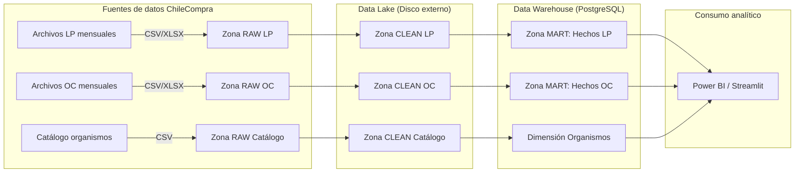

# TFM — Diseño e implementación de un sistema ETL automatizado para la integración y análisis de datos abiertos de contratación pública  

**Trabajo Fin de Máster (TFM)**

## 0. Naturaleza del documento

Este documento describe la **arquitectura técnica operativa** del sistema implementado.

Su propósito es:

- Detallar los componentes técnicos reales del pipeline.
- Explicar la infraestructura Docker y PostgreSQL.
- Documentar el flujo físico del dato.
- Describir los mecanismos de ejecución y control.

No constituye el marco académico formal del modelo; dicha formalización se encuentra en:

`03_architecture_academia_ver1.md`

## 1. Resumen Ejecutivo

El proyecto **TFM – ChileCompra Data Platform** implementa un **pipeline reproducible** para integrar datos de compras públicas de Chile, combinando:

- Licitaciones públicas (LP)
- Órdenes de compra (OC)
- Organismos compradores

El objetivo es disponer de una **plataforma de datos** que permita construir indicadores de eficiencia, competencia y transparencia, apoyando análisis posteriores en Power BI, Streamlit u otras herramientas.

El sistema se basa en:

- Contenedores Docker (PostgreSQL, ETL, n8n)
- Data Lake en disco externo (zonas RAW, CLEAN y MART)
- Data Warehouse en PostgreSQL
- Orquestación de tareas con n8n
- Código reproducible en Python, versionado en GitHub

---

## 2. Objetivo del Pipeline

Construir un **pipeline de datos modular, documentado y reproducible** que:

1. Ingesta datos de ChileCompra desde archivos mensuales (LP y OC) y, en una fase posterior, desde la API.  
2. Almacena los datos en un **Data Lake** estructurado por zonas (RAW, CLEAN, MART).  
3. Carga datos consolidados y modelados en un **Data Warehouse PostgreSQL**.  
4. Permite la **orquestación automática** de procesos (carga, validación, actualización de marts) mediante n8n.  
5. Mantiene un **historial auditable** de ejecuciones y cambios a través de Git y logs.

---

## 3. Alcance y Restricciones

### 3.1 Alcance

- Procesamiento de datos desde 2024–2025 (LP, OC y organismos compradores).  
- Manejo de archivos muy pesados (cada mes ~750 MB; conjunto LP ~10 GB, OC ~10 GB).  
- Estructura de Data Lake con varias capas.  
- Carga en PostgreSQL para explotación analítica.  
- Documentación técnica completa (este documento + README + scripts comentados).  
- Uso de **n8n** como orquestador principal (no se usa Prefect u otros).

### 3.2 No Incluido

- Publicación de los datos crudos en GitHub (por tamaño y por política).  
- Implementación de dashboards definitivos (se deja preparado el modelo para consumir desde BI).  
- Exposición pública de credenciales o ficheros `.env`.

### 3.3 Restricciones Técnicas

- Los datos crudos (CSV/XLSX/JSON/ZIP) **no se suben al repositorio**.  
- El Data Lake reside en un **disco externo de 450 GB** (WD450); el repositorio vive en el disco interno.  
- Todo el código debe ser ejecutable vía Docker y scripts bash, sin depender de configuraciones manuales ad-hoc.

---

## 4. Arquitectura General

### 4.1 Diagrama de Alto Nivel



### 4.2 Estado de Infraestructura (verificable al 06-12-2025)

- Servicios activos: chile-pg, etl, pgadmin en red tfm-net.  
- Base chilecompra con tablas licitaciones, stg_lic_2024_09, stg_oc_2024_09.  
- Acceso de administración vía pgAdmin en localhost:8082.

> Nota: ver `docs/04_Guia_Contribucion_y_Reproducibilidad.md` para las instrucciones específicas que Copilot debe seguir al trabajar en este repositorio.

---

## Arquitectura Técnica — Versión 2.0

**Proyecto:** TFM ChileCompra Data Platform  
**Fecha de actualización:** 2025-12-08

---

## 1. Objetivo del Sistema

La arquitectura implementada permite:

- Procesar datos de ChileCompra mediante archivos descargados manualmente.
- Organizar un Data Lake estructurado para ingesta incremental mensual.
- Transformar los datos hacia un Data Warehouse en PostgreSQL.
- Preparar la base para consumo analítico (Power BI/Streamlit) y futura orquestación con n8n.

---

## 2. Componentes Principales

| Componente                      | Rol               | Descripción                                      |
|---------------------------------|-------------------|--------------------------------------------------|
| Ubuntu 24.04                    | Infraestructura   | Ambiente físico del proyecto                     |
| Docker + Docker Compose         | Orquestación      | Gestión de contenedores                          |
| PostgreSQL 15                   | DW                | Base de datos estructurada                       |
| pgAdmin4                        | Administración DB | Interfaz visual para consultas                   |
| Servicio ETL (FastAPI + Python) | Procesamiento     | Ejecuta ingestas, limpieza y cargas              |
| Data Lake en disco externo      | Almacenamiento    | Organización RAW → CLEAN → MART + Metadata       |

---

## 3. Arquitectura Lógica

```text
            ┌──────────────────┐
            │ CSV / Manual RAW │
            └─────────┬────────┘
                      │ ingestión
                      ▼
        ┌─────────────────────────────────┐
        │      DATA LAKE (/data_lake)     │
        ├─────────────────────────────────┤
        │ 01_RAW                          │
        │ 02_CLEAN                        │
        │ 02_INBOX                        │       
        │ 03_MART                         │
        │ 04_Metadata (schemas, logs)     │
        └─────────────────────────────────┘
                      │ transform
                      ▼
            ┌──────────────────┐
            │     ETL Docker   │
            └─────────┬────────┘
                      │ load
                      ▼
        ┌─────────────────────────────────┐
        │ PostgreSQL (chile-pg)           │
        ├─────────────────────────────────┤
        │ RAW → CLEAN → DW (FACT / DIM)   │
        └─────────────────────────────────┘
                      │ consumo
                      ▼
            ┌──────────────────┐
            │ BI / Streamlit   │
            └──────────────────┘
```

---

## 4. Configuración Técnica Clave

### Variables Activas

| Variable            | Valor esperado  | Verificación                     |
|---------------------|-----------------|----------------------------------|
| `DATA_LAKE_ROOT`    | `/data_lake`    | ✔ validado dentro del contenedor |
| `.env` sincronizado | Sí              | ✔ alineado con docker-compose.yml|
| Montaje DL → ETL    | Correcto        | ✔ lectura parquet confirmada     |

---

## 5. Validación de Funcionamiento

| Elemento validado                                             | Resultado |
|---------------------------------------------------------------|-----------|
| Conexión ETL → PostgreSQL                                     | ✔         |
| Montaje Data Lake dentro del contenedor                       | ✔         |
| Lectura Parquet y generación automática de schemas            | ✔         |
| Scripts de control Docker (`02-tfm.sh`, `03-status.sh`, etc.) | ✔         |

---

## 6. Estado Técnico del Pipeline

| Etapa                           | Estado            |
|---------------------------------|-------------------|
| Arquitectura Docker estable     | ✔                 |
| Data Lake estructurado          | ✔                 |
| ETL conectado a base            | ✔                 |
| Diccionarios de datos generados | ✔                 |
| Modelo físico DW                | ✔                 |

---

## 7. Referencias de Metadata Técnica

Como parte del proceso de auditoría estructural de los datos fuente y de la definición del modelo del Data Warehouse, se generaron y formalizaron tres artefactos de metadata clave. Estos archivos permiten:

- estandarizar la interpretación de columnas provenientes de ChileCompra,
- definir tipos de datos destino en PostgreSQL,
- establecer catálogos base para entidades del gobierno proveedoras o consumidoras de datos,
- asegurar reproducibilidad y trazabilidad en fases posteriores de diseño y carga del DW.

Los archivos se encuentran almacenados en la ruta:

``` text
/docs/metadata/
```

| Archivo | Descripción | Uso en la arquitectura |
|---------|-------------|------------------------|
| `schema_lic_clean_any.csv` | Esquema inferido desde la capa `02_CLEAN` del dataset de Licitaciones LP | Referencia para rulebook, diseño de `fact_licitacion`, constraints y validaciones |
| `schema_oc_clean_any.csv` | Esquema inferido desde la capa `02_CLEAN` de Órdenes de Compra OC | Base para `fact_orden_compra`, mapeo de tipos y consistencia semántica |
| `catalogo_organismos_2025-10-17.csv` | Catálogo oficial del listado de organismos compradores del Estado de Chile | Base para `dim_organismo_comprador`, `dim_sector` y normalización geográfica |

> Estos artefactos forman parte del **cierre técnico de la Fase 2** y serán consumidos directamente en Fase 3 para generar automáticamente el **Rulebook CLEAN → DW** y posteriormente el modelo físico SQL.
---

## Estado de la arquitectura al cierre de la Fase 3

Al finalizar la Fase 3, la plataforma cuenta con:

- Arquitectura Docker Compose definida y operativa
- PostgreSQL 15 desplegado como núcleo del Data Warehouse
- Data Lake estructurado en capas (RAW / CLEAN / MART / Metadata)
- Scripts de inicialización, control y auditoría
- Separación clara entre almacenamiento y procesamiento

---

### Data Lake — Capa RAW

La capa RAW representa el estado original de las fuentes ChileCompra, sin alteración semántica.
Su función es garantizar trazabilidad y reproducibilidad.

Características:

- Persistencia en disco externo
- Organización por dominio funcional
- Versionado implícito por fecha de extracción

---

## Fase 4 — Orquestación y Automatización con n8n

La Fase 4 incorpora un motor de orquestación local basado en n8n, desplegado mediante Docker Compose, con el objetivo de coordinar, automatizar y auditar los flujos ETL del sistema ChileCompra Data Platform.

### Componentes principales

- **n8n (Docker)**: motor de workflows
- **PostgreSQL (DW Core)**: base analítica principal
- **PostgreSQL interno n8n**: persistencia de workflows y ejecuciones
- **Docker Networks**: aislamiento de tráfico
- **Volúmenes persistentes**: protección ante reinicios

### Persistencia y seguridad

- Credenciales almacenadas en volúmenes persistentes
- Autenticación básica habilitada
- Variables sensibles aisladas en `.env.n8n`

### Backup y recuperación

- Backups completos de:
  - Datos n8n
  - Base de datos interna n8n
- Manifiesto de backup con checksum y timestamp
- Procedimiento reproducible documentado en evidencia

### Observabilidad

- Logs de contenedor
- Healthchecks
- Auditoría manual mediante scripts del proyecto

---

## Arquitectura — Consideraciones de Automatización (Post-Fase 5)

La arquitectura técnica de la plataforma **contempla explícitamente** la posibilidad
de incorporar un mecanismo de **activación automática del pipeline de datos**
basado en una zona de entrada (*Drop Zone / INBOX*).

### Patrón conceptual definido

- Existencia de un directorio de entrada controlado (`INBOX`) para archivos crudos
  de Licitaciones (LIC) y Órdenes de Compra (OC).
- Identificación del periodo a procesar a partir del nombre del archivo.
- Control de idempotencia mediante metadatos de ejecución.
- Orquestación potencial mediante n8n u otro scheduler local.

### Decisión arquitectónica

Este mecanismo de automatización **NO se implementa en la Fase 5** del proyecto.

La razón es metodológica y técnica:

- La Fase 5 tiene como objetivo la **habilitación analítica correcta**
  del Data Warehouse y la capa BI para un **periodo piloto**.
- La automatización continua solo es recomendable una vez
  que el modelo, los loaders y las validaciones han sido completamente validados.

La automatización por INBOX se considera una **extensión futura de la plataforma**
y podrá ser implementada como una fase posterior (upgrade),
sin modificar la arquitectura base definida en las Fases 1 a 4.

## 🧱 Implementación DW Analítico — Gate 3 (Piloto 2024-09)

### Hechos implementados

- `fact_ordenes_compra`
- `fact_licitaciones`

### Características técnicas clave

- Grano a nivel línea (BK compuesto)
- Periodo congelado (`2024-09`)
- Integridad referencial estricta (FK completas)
- Reejecución idempotente vía `ON CONFLICT`

### Manejo de datos monetarios (OC)

La fuente ChileCompra utiliza coma como separador decimal en `montototaloc`.

Se implementó lógica explícita en SQL:

- Detección de patrón numérico
- Conversión controlada coma → punto
- Cast seguro a `numeric(18,2)`

Esta lógica reside exclusivamente en:

- `/sql/gate3_fact_ordenes_compra_2024_09_v2.sql`

No se realizan correcciones posteriores en BI.

---

## Gate 3 — Decisiones Técnicas Críticas (DW Analítico)

### Corrección semántica de montos OC

Fuente: ChileCompra (`public.stg_oc_2024_09`)

Hallazgo:

- `montototaloc` utiliza coma como separador decimal
- Regex genérico producía inflado x10^6

Decisión técnica:

- Regla determinística basada en patrón
- Implementada en SQL (no en BI, no en ETL Python)

Regla:

- '^\d+,\d+$' → coma decimal → replace(',', '.') → numeric(18,2)
- Otros formatos → NULL documentado

Impacto:

- Garantiza consistencia analítica
- Evita sesgo en KPIs monetarios
- Cumple principios DW (datos correctos en origen semántico)

Script oficial:

- `/sql/gate3_fact_ordenes_compra_2024_09_v2.sql`

---

## Pipeline Automático de Carga Mensual (ETL DW)

La plataforma implementa un pipeline automático por período mensual, ejecutable localmente y sin intervención manual en SQL.

### Flujo técnico

INBOX (CSV mensual)
→ cli_monthly.py (STG dinámico)
→ load_dim_fecha.py
→ Gate 3 (Facts vía SQL templates)
→ Auditoría SQL
→ Registro en etl_control_cargas

### Principios técnicos

- Idempotencia fuerte por período
- Staging dinámico por mes
- SQL parametrizado
- Validaciones semánticas obligatorias
- Reproducibilidad completa

### Ejecución estándar

```bash
docker compose exec etl python /app/run_period.py --period YYYY-MM
```

## Automatización y Rigor Metodológico del ETL

El TFM implementa un proceso ETL completamente automatizado para cargas mensuales, alineado con principios de ingeniería de datos modernos:

- Automatización reproducible
- Control de calidad basado en reglas
- Idempotencia verificable
- Auditoría explícita de resultados

Cada período cargado es tratado como una unidad cerrada de procesamiento, con validación técnica y semántica antes de ser aceptado en el Data Warehouse.

Este enfoque garantiza:

- Trazabilidad
- No duplicación
- Escalabilidad temporal
- Reproducibilidad académica

---

## Arquitectura de Automatización Mensual (Fase 5)

### Flujo lógico del pipeline

INBOX (CSV mensual)
→ STG mensual (public.stg_*)
→ Dimensiones (idempotentes)
→ Gate3 DW (facts)
→ Validaciones
→ Control de cargas

### Componentes técnicos

- **Runner mensual**
  - Script: `etl/run_period.py`
  - Parámetro obligatorio: `--period YYYY-MM`
  - Ejecutable tanto manualmente como vía orquestador (n8n)

- **STG genéricas**
  - Se crean dinámicamente por periodo
  - Ejemplo:
    - `stg_lic_2024_11`
    - `stg_oc_2024_11`

- **Gate3 DW**
  - Ejecutado desde templates SQL parametrizados
  - Garantiza:
    - limpieza
    - tipado correcto
    - eliminación de sentinels

- **Tabla de control**
  - `dw.etl_control_cargas`
  - Fuente única de verdad del estado por periodo y entidad

### Principios garantizados

- Idempotencia
- Reejecución segura
- Trazabilidad CLEAN → DW
- No duplicados

---

### Extensión de evidencia (multi-periodo)

Aunque la metodología define un periodo piloto (2024-09) como referencia inicial,
la plataforma fue validada adicionalmente en una ventana multi-periodo
(2024-09 a 2024-12 y 2025-02 a 2025-10), aplicando controles globales:

- Idempotencia por periodo (`dw.etl_control_cargas`)
- Unicidad BK+periodo (sin duplicados)
- Control semántico monetario OC (sentinel + percentiles)
- Gestión de periodos anómalos mediante decisiones NO-OP / EXCEPCION_FUENTE

La evidencia completa se registra en `docs/05_project_log.md` y en la carpeta
`evidencias/fase5_cierre_2026-01-20/`.

---

### Rol de n8n como orquestador de decisiones

En este proyecto, n8n no se limita a ejecutar tareas técnicas,
sino que implementa **lógica de decisión explícita** sobre la ejecución del ETL
por periodo (RUN / NO-OP / EXCEPCIÓN_FUENTE).

Esto permite:

- preservar la integridad del Data Warehouse,
- evitar cargas analíticamente inválidas,
- registrar evidencia auditable de cada decisión.

### Orquestación basada en decisiones analíticas

El rol de n8n en esta arquitectura no se limita a la ejecución de tareas
técnicas, sino que incorpora lógica de decisión explícita sobre el
comportamiento del pipeline por periodo.

Para cada periodo analizado, el sistema adopta una de las siguientes decisiones:

1. **RUN**  
   Los datos cumplen condiciones estructurales, volumétricas y analíticas
   mínimas, por lo que se ejecuta el proceso completo de carga al DW.

2. **NO-OP**  
   Los datos son válidos en origen, pero no aptos para análisis comparativo
   o explotación analítica. En este caso, no se ejecuta el ETL y se registra
   evidencia auditable de la decisión.

3. **EXCEPCIÓN_FUENTE**  
   Los datos presentan errores estructurales de origen que impiden su uso
   analítico, por lo que el periodo se excluye explícitamente del pipeline.

Este enfoque permite una orquestación gobernada, determinística e idempotente,
alineada con buenas prácticas de ingeniería de datos.

Gestión de periodos anómalos:
Los periodos con NO-OP o EXCEPCIÓN_FUENTE se registran en tablas de control, sin afectar el modelo dimensional.

---

### Modo de ejecución del servicio ETL

El servicio ETL del proyecto ChileCompra Data Platform está implementado en Python
y se despliega mediante Docker como parte del stack reproducible del TFM.

Aunque el ETL se encapsula en un contenedor y utiliza componentes compatibles con
FastAPI, su **modo de operación es de tipo batch mensual**, no de servicio
permanente (*always-on*).

La ejecución del ETL se realiza por período (YYYY-MM) mediante scripts canónicos
(`run_period.py`), que orquestan de forma secuencial:

- la carga de datos crudos desde el Data Lake,
- la creación dinámica de tablas de staging,
- la carga idempotente de dimensiones y hechos en el Data Warehouse,
- la ejecución de validaciones obligatorias,
- y el registro de estado por período en tablas de control.

Este diseño responde a la naturaleza de los datos públicos procesados
(actualización mensual) y a los objetivos académicos del TFM, priorizando
reproducibilidad, trazabilidad y control por período por sobre la disponibilidad
continua del servicio.

Por esta razón, el ETL **no requiere exposición permanente de endpoints HTTP ni
chequeos de salud en tiempo real**, y su correcta ejecución se valida mediante
evidencia de carga, auditorías SQL y registros de control.

---

### Servicio ETL (contenedor Docker)

El componente ETL se implementa como un servicio contenedorizado con Docker.
Su propósito es ejecutar procesos de carga batch sobre el Data Warehouse y
proveer un entorno reproducible para auditoría técnica del proyecto.

El ETL no corresponde a un servicio de negocio ni a un proceso de ejecución continua.
Su activación se realiza de forma controlada (manual u orquestada) y su disponibilidad
en tiempo de ejecución no condiciona la validez de la fase BI.

El endpoint `/health` expuesto por el contenedor cumple un rol exclusivamente técnico:
verificar conectividad a la base de datos, configuración del entorno y estabilidad
del servicio desde el punto de vista de reproducibilidad.

---
